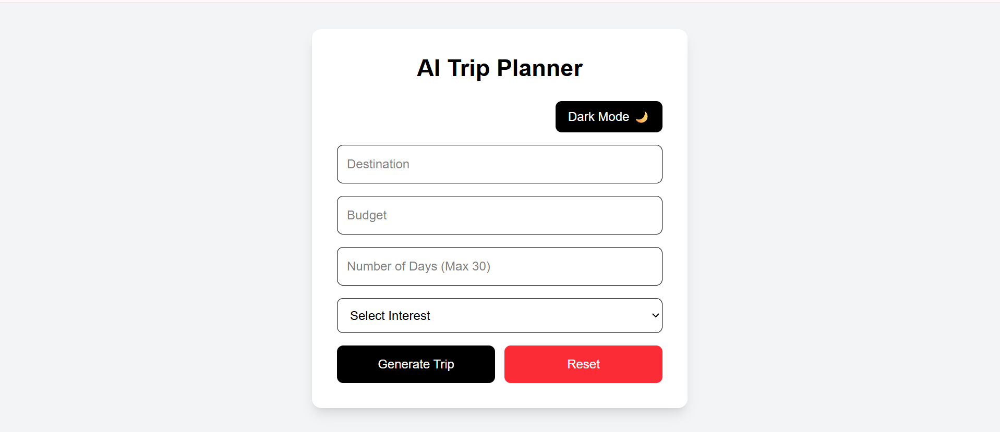

# AI Trip Planner

A smart travel planning web app built with Next.js, TypeScript, React, and Tailwind CSS.

## Live Demo

https://ai-trip-planner-beta-five.vercel.app/

## Features

- Smart itinerary generation
- Destination-wise images
- Budget breakdown
- Cost per day calculation
- Hotel recommendations
- Google Maps attraction links
- Travel tips
- Weather suggestions
- Dark mode
- Copy trip plan
- Download PDF
- Share trip
- Save/remove favorite destinations
- 30-day validation

## Tech Stack

- Next.js
- React
- TypeScript
- Tailwind CSS
- Vercel

## Project Screenshots

Add screenshots here:

```md

